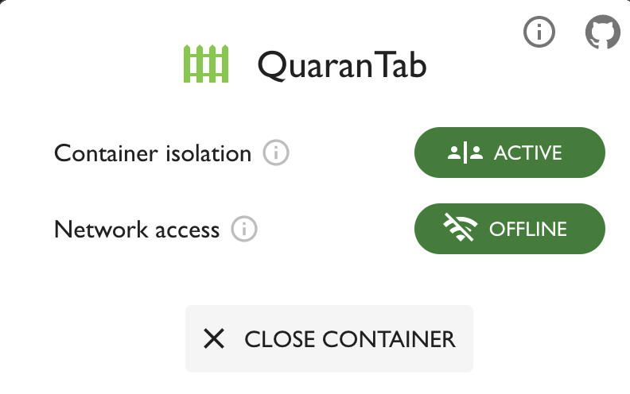
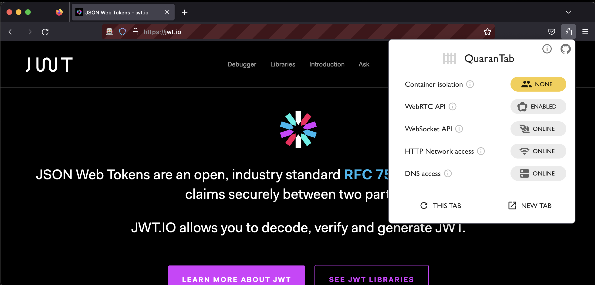
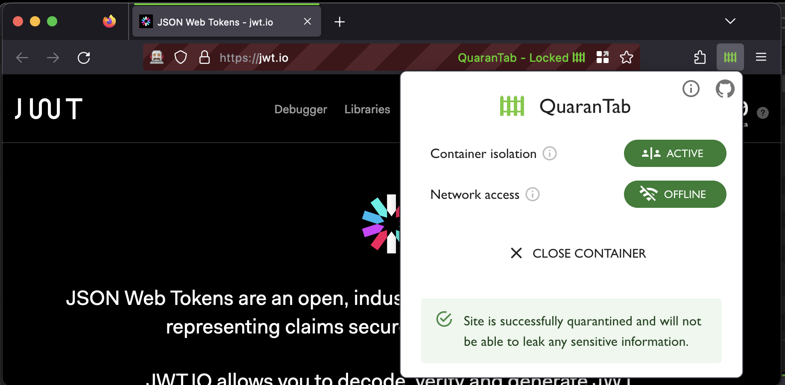

# QuarantTab

<a href="https://addons.mozilla.org/firefox/addon/quarantab/">
  </img>
</a>

Safely use sensitive data with online tools. Browser extension to cut-off network access to a website to prevent it from phoning home. This allows you to input sensitive data into a website without worrying about it being stolen.



# Contents

- [Use cases](#use-cases)
  - [Bad use cases](#bad-use-cases)
- [Where to get it](#where-to-get-it)
- [How to use](#how-to-use)
- [How it works](#how-it-works)
- [Permissions](#permissions)
- [Bug bounty](#bug-bounty)
- [Building](#building)

## Use cases

Do use this to convert/parse sensitive data:

- Parse a live JWT token in https://jwt.io
- Decode a Base64 Authorization header
- Hash a password for /etc/shadow
- Parse a Protobuf message

### Bad use cases

Do **not** use this extension to **generate** sensitive data:

- Generate a strong password online
- Generate a Bitcoin wallet online
- Generate a PGP key online

A malicious website may show you pre-generated data which may seem random to you, but is actually known to the attacker even before you load the website. Cutting off network access will not prevent this situation.

## Where to get it

I would recommend to review the code, build the extension yourself and install it manually.

If you simply install the extension from the Firefox Add-ons store, you are implicitly trusting me that the extension does what it says it does.

You were warned: [Get it from the Firefox Add-ons store](https://addons.mozilla.org/firefox/addon/quarantab/)

## How to use

There are two steps to put a website under quarantine. One is to isolate it from all other website running in your browser using a temporary Container. The second is to cut-off network access to the website.

### Container isolation

You may re-open your current tab or a new tab in a temporary container. This will isolate the website from all other websites running in your browser.



### Network access

Next step is to cut-off network access to the website. This will prevent the website from phoning home and sending your sensitive data to a malicious server.

If you are re-opening your current tab, this step is automatic once the page fully loads.


### Using

At this point, the website is completely locked down. You can now safely use the website and input sensitive data. No data will leak out of the website.

If a website stops working, it probably means that it depends on additional resources that it cannot fetch anymore because network access is cut-off.

Some tools actually work by sending your data to a server for processing, so they will not work with this extension by design.



### Cleaning up

When you are done using the site, simply close it and all browser data will be automatically deleted.

## How it works

This extension takes advantage of Mozilla Firefox's [contextualIdentities API](https://developer.mozilla.org/en-US/docs/Mozilla/Add-ons/WebExtensions/API/contextualIdentities) to create temporary Containers in order to:
- Isolate a website from the rest of the browser
- Cut-off network access to just this Container
- Easily delete all data when you are done using the website

Interesting part is that the API semi-functions even without the [Multi-Account Containers extension](https://github.com/mozilla/multi-account-containers) installed with a caveat:
- When calling `browser.contextualIdentities.remove`, the Container is removed, but open tabs continue to be open and seem to be using a zombie-leftover of this container. The container cannot be referenced, but the site continues to operates as if it exists. This is a bug in Firefox. To solve this, I explicitly close all remaining tabs in that Container.

Attacks this extension protects against:
- Network access: Container is routed to a non-existent Socks proxy pointing to 127.0.0.1
- DNS leaks by routing DNS requests via Socks: site could try to resolve my-sensitive-info.badsite.com
- Storing sensitive data in Storage and Cookies
- Communicating with other websites

Out of scope attacks:
- Malicious other extensions communicating with the website
- Socks proxy running on localhost allowing communication with the website
- Container exploits
- Pre-generated data (e.g. using a Bitcoin Wallet Generator that shows you one of 100 pre-generated wallets)

Potential implementation in Chromium (Would love feedback here):
- Use private window as a temporary container

## Permissions

Due to the nature of this extension, it requires a lot of permissions. Ideally Firefox would allow extensions to enable offline-mode. Instead, we have to disable each possible network access individually.

- "proxy" - Required to cut-off network access to the website by routing requests to a non-existent Socks proxy
- "tabs" - Required to re-open a tab in a new container
- "cookies" - Required for manipulating Container data and clearing browser data for temporary containers
- "contextualIdentities" - Required for creating/deleting Containers
- "privacy" - Required for temporarily disabling WebRTC globally
- "webRequest" - Required for monitoring active connections to determine when it's safe to use 
- "scripting" - Required for injecting a content script for shutting down active connections
- "storage" - Required for keeping track of WebRTC initial enable state
- "<all_urls>" - Required to intercept proxy web requests for all sites

## Bug bounty

If you find a bug, please report it to me. A bug bounty is available for this project as long as it meets the following criteria:

1. The bug shows an exploit to exfiltrate data out of a website that is under a locked-down quarantine.
2. You are the first person to report the bug.
3. There are funds available in the bug bounty.
4. The amount is proportional to the severity of the bug at our discretion.
5. For an exploit that leaks any data under all circumstances, the bounty would be 100 USD.
6. The bug exists in this extension or the design of it. It excludes explots in the browser itself, the contextualIdentities implementation or isolation guarantees.

### Bug bounty pool

Available: __100 USD__

_the amount will grow in the future proportionally to my confidence_

#### History

- __+100 USD__ Initial pool by @matusfaro (2023-09-10)
- __-100 USD__ to @dz2742 for [Established WebSocket session remains open](https://github.com/matusfaro/quarantab/issues/2) (2023-09-11)
- __+100 USD__ Replenished by @matusfaro (2023-09-11)

## Building

```sh
# Install packages
npm install

# Live Dev
npm run start firefox
```

## Release

1. Bump and commit version in `package.json`

2. Build extension with `npm run build firefox`

3. Upload `dist/firefox.xpi` to [Firefox Add-ons store](https://addons.mozilla.org/en-US/developers/addon/quarantab/versions)
